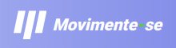

Sistema iniciado durante o NLW#04 da rocketseat.

O sistema foi pensado para ajudar pessoas que ficam por longos períodos de tempo em frente ao computador.

<h3> 🛠 Tecnologias</h3>

As seguintes ferramentas foram utilizadas na construção do projeto:

- [NextJS](https://nextjs.org/)
- [Node.js](https://nodejs.org/en/)
- [React](https://pt-br.reactjs.org/)
- [TypeScript](https://www.typescriptlang.org/)

<h4 align="center"> 
	🚧  Movimente-se   Em construção...  🚧
</h4>

### Autor
---

 
 Jadson Lima
 
Feito por Jadson Lima 👋🏽 Entre em contato!

 

